# 🚀 AI-Powered GitHub PR Reviewer (RAG + Gemini)

An intelligent full-stack SaaS application that automatically reviews GitHub pull requests using **Retrieval Augmented Generation (RAG)** and **Google Gemini AI**.  

It analyzes your entire codebase, retrieves relevant context, and generates high-quality, human-like code reviews — instantly.

---

## ✨ Features

### 🤖 AI-Powered Code Reviews
- Automatic PR review generation using **Gemini 2.5 Flash**
- Context-aware feedback using **RAG + Pinecone**
- Includes:
  - Code walkthrough
  - Summary
  - Strengths & issues
  - Suggestions
  - Sequence diagrams
  - Even fun AI-generated poems 🎭

---

### 🔗 GitHub Integration
- Connect multiple repositories
- Webhook-based PR event handling
- Real-time review generation on PR open/update
- Direct PR comments via GitHub API

---

### 🧠 RAG Implementation
- Codebase indexing using vector embeddings
- Semantic search across entire repo
- Context retrieval for accurate AI responses

---

### 📊 Dashboard & Analytics
- Real-time stats:
  - Repositories
  - Commits
  - Pull Requests
  - Reviews
- Contribution graph visualization
- Monthly activity tracking
- Interactive charts

---

### 📝 Review Management
- Full review history
- Status tracking (completed / pending / failed)
- Direct GitHub PR links
- Rich preview of AI-generated reviews

---

### 📦 Repository Management
- Browse & connect repositories
- Search and filter functionality
- Infinite scroll pagination
- Connection status tracking

---

### 👤 User Management
- Secure authentication with Better Auth
- Profile settings
- Session handling
- Usage monitoring

---

### ⚙️ Background Processing
- Async job handling using **Inngest**
- Repository indexing
- AI review generation
- Concurrency control

---

### 🎨 Modern UI/UX
- Responsive design
- Dark mode support 🌙
- Skeleton loaders & smooth states
- Toast notifications
- Built with **shadcn/ui + Radix UI**

---

## 🏗️ Tech Stack

### Frontend
- Next.js 16
- React 19
- TypeScript
- Tailwind CSS 4

### Backend
- Next.js API Routes
- Server Actions

### Database
- PostgreSQL (Neon)
- Prisma ORM

### AI / ML
- Google Gemini AI  
  - `gemini-2.5-flash`
  - `text-embedding-004`

### Vector DB
- Pinecone

### Background Jobs
- Inngest

### Authentication
- Better Auth

### Payments
- Polar

### Data Fetching
- TanStack Query (React Query)

### GitHub Integration
- Octokit API

### Charts & Forms
- Recharts
- React Hook Form + Zod

---

## ⚡ How It Works

1. User connects GitHub repository
2. App indexes the codebase using embeddings
3. PR event triggers webhook
4. Relevant context retrieved via Pinecone
5. Gemini AI generates structured review
6. Review is:
   - Stored in DB
   - Displayed in dashboard
   - Posted on GitHub PR

---

## 🧠 Architecture Overview

```
GitHub Webhook → Next.js API → Inngest Job Queue
                         ↓
                 Code Embedding (Gemini)
                         ↓
                    Pinecone DB
                         ↓
              Context Retrieval (RAG)
                         ↓
                 Gemini AI Review
                         ↓
      PostgreSQL + GitHub PR Comment
```
### System Architecture

```mermaid
graph TD
    subgraph Flow1 [1. User Login Flow]
        U1([User]) --> GH[GitHub OAuth]
        GH --> BA[Better Auth]
        BA --> CS[Create Session]
        CS --> D[Dashboard]
    end

    subgraph Flow2 [2. Repository Connection Flow]
        U2([User]) --> CR[Connect Repo]
        CR --> SDB[Save to DB]
        CR --> CW[Create Webhook]
        SDB --> TI[Trigger Indexing]
        CW --> TI
        TI --> IJ[Inngest Job]
        IJ --> FF[Fetch Files]
        FF --> GE[Generate Embeddings]
        GE --> SP[(Store in Pinecone)]
    end

    subgraph Flow3 [3. PR Review Flow]
        GPR[GitHub PR] --> WH[Webhook]
        WH --> IE[Inngest Event]
        IE --> CL{Check Limits}
        CL --> FD[Fetch Diff]
        FD --> RC[Retrieve Context RAG]
        RC --> GRA[Generate Review AI]
        GRA --> PGH[Post to GitHub]
        GRA --> SDB3[Save to DB]
        PGH --> IU[Increment Usage]
        SDB3 --> IU
    end

    %% Styling for visual clarity in Dark/Light mode
    style Flow1 fill:transparent,stroke:#333,stroke-width:2px
    style Flow2 fill:transparent,stroke:#333,stroke-width:2px
    style Flow3 fill:transparent,stroke:#333,stroke-width:2px
```



## 🚀 Getting Started

### 1. Clone the Repository
```bash
git clone https://github.com/Ninjasri98/AI-Code-Review-Platform
cd AI-Code-Review-Platform
```

---

### 2. Install Dependencies
```bash
npm install
```

---

### 3. Setup Environment Variables

Create a `.env` file:

```env
DATABASE_URL=
GITHUB_CLIENT_ID=
GITHUB_CLIENT_SECRET=

NEXT_PUBLIC_APP_BASE_URL=

PINECONE_DB_API_KEY=

GOOGLE_GENERATIVE_AI_API_KEY=

INNGEST_EVENT_KEY=

BETTER_AUTH_SECRET=
BETTER_AUTH_URL=

```

---

### 4. Setup Database
```bash
npx prisma migrate dev
npx prisma generate
```

---

### 5. Run Development Server
```bash
npm run dev
```

---

## 📈 Future Improvements
- Multi-language code support
- Team collaboration features
- Slack/Discord integrations
- Custom AI review rules
- Advanced security analysis

---

## 🤝 Contributing

Contributions are welcome!  
Feel free to open issues or submit pull requests.

---

## 📄 License

This project is licensed under the **MIT License**.

---

## 💡 Inspiration

Built to simplify code reviews and boost developer productivity using AI.
